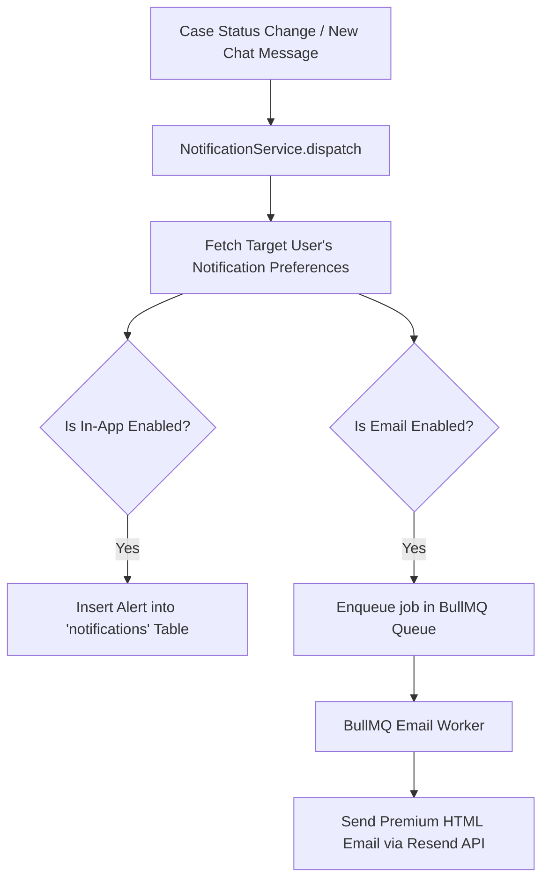

# Notification System: Triggers and Target Users

This guide explains how notification triggers are structured inside IconicConnect, where they are executed in the codebase, and how target users are dynamically resolved.

---

## 🛠️ Triggers Registry & Target Audience

| Notification Event (`type`) | Database Event Key | Trigger Source Path | Actor | Target User (Recipient) |
| :--- | :--- | :--- | :--- | :--- |
| **Case Assigned** | `case_assigned` | `PUT /api/cases/[id]` | Admin / QC / Designer | The **Assigned Designer** who received the case. |
| **Design Feedback / Revision** | `case_feedback` | `PUT /api/cases/[id]` | Client / Admin / QC | The **Assigned Designer** (so they can make revision corrections). |
| **Case Approved** | `case_approved` | `PUT /api/cases/[id]` | Client / Admin / QC | The **Assigned Designer** (alerting them of successful completion). |
| **Case Rejected** | `case_rejected` | `PUT /api/cases/[id]` | Client / QC | The **Assigned Designer** (informing them to rework the design). |
| **Case Put on Hold** | `case_hold` | `PUT /api/cases/[id]` | Admin / QC | **Assigned Designer** & **Client Lab** (warning them of paused flow). |
| **Case Cancelled** | `case_cancel` | `PUT /api/cases/[id]` | Client / Admin | The **Assigned Designer** (alerting them to stop all active work). |
| **Live Chat Message** | `chat_message` | `POST /api/cases/[id]/chat` | Message Sender | **Counterparts**: If Client sends, alerts Designer/QC/Admin. If Designer/QC/Admin sends, alerts Client. |

---

## 🔍 How Triggers Work under the Hood

Notification triggers are designed to be **non-blocking** (asynchronous and safe from main transaction failures) using the `NotificationService.dispatch(...)` layer.



### 1. In-App Alerts Delivery
When In-App delivery is enabled by the target user's preference settings, a row is inserted into the `notifications` table:
* It stores the `userId` (Target), `type` (Trigger category), `title`, `message`, the target entity `link` (e.g. `/cases/case-uuid-123`), and JSONB `metadata` for rich UI rendering.
* A live React Query hook (`refetchInterval: 30000`) in the header automatically updates the red unread dot and badge numbers reactively.

### 2. Email Delivery Pipeline
When Email delivery is preferred:
* The service pushes a lightweight job into the BullMQ Redis queue containing the target user's email address and formatted HTML.
* The background worker (`src/lib/queue/worker.ts`) picks up the job and dispatches it through the configured email channel (e.g., Resend, SendGrid) asynchronously.

---

## 📝 Code Integration Examples

### Triggering Status Changes
Inside `src/app/api/cases/[id]/route.ts`, when status changes are processed:
```typescript
import { NotificationService } from '@/src/lib/notifications/notification-service';
import { NotificationType } from '@/src/lib/notifications/notification-events';

// Trigger CASE_ASSIGNED
await NotificationService.dispatch({
  type: NotificationType.CASE_ASSIGNED,
  actorUserId: currentUser.id,
  targetUserId: designerId,
  title: 'New Case Allocated',
  message: `Case ${caseCode} has been assigned to you.`,
  link: `/cases/${caseId}`,
  metadata: { caseId }
});
```

### Triggering Chat Messages
Inside `src/app/api/cases/[id]/chat/route.ts`, when a new message is submitted:
```typescript
import { NotificationService } from '@/src/lib/notifications/notification-service';
import { NotificationType } from '@/src/lib/notifications/notification-events';

// Dynamically target the counterpart (Client vs. Internal Staff)
await NotificationService.dispatch({
  type: NotificationType.CHAT_MESSAGE,
  actorUserId: senderId,
  targetUserId: receiverId,
  title: `New Message from ${senderName}`,
  message: messageBody,
  link: `/cases/${caseId}`,
  metadata: { caseId, messageId }
});
```
